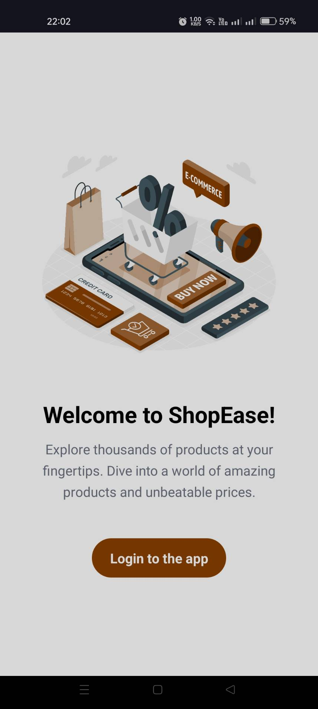
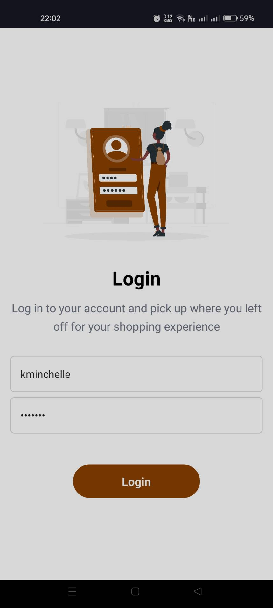
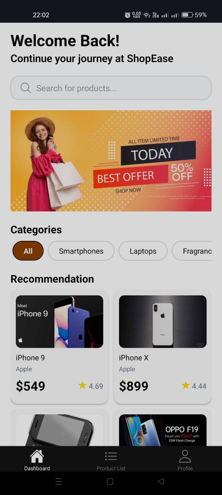
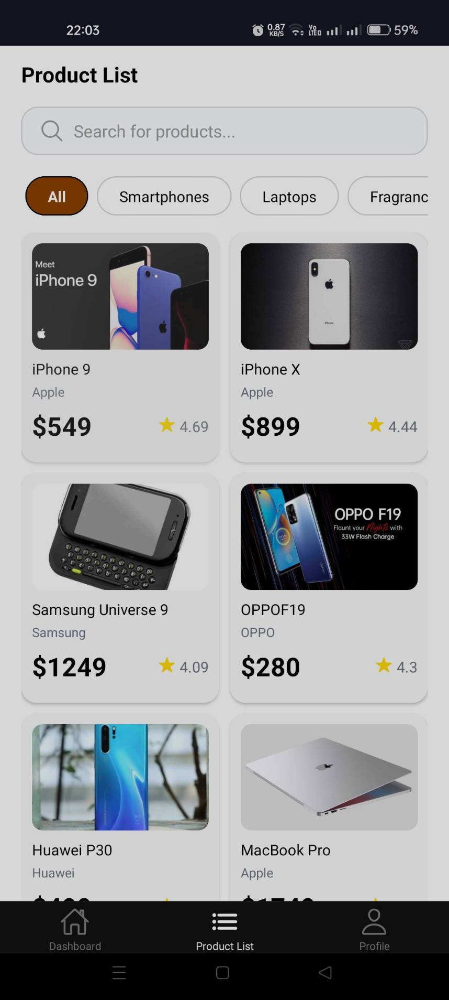
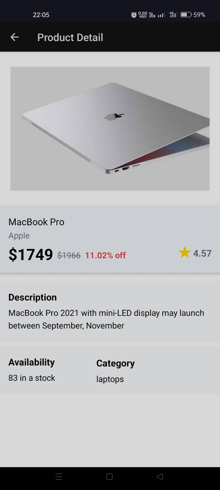
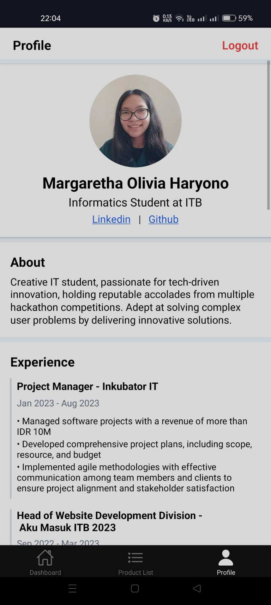

# ShopEase E-Commerce Mobile App

<table style="width:100%; text-align:center">
    <tr>
        <td width="100px" align="center"></td>
        <td width="100px" align="center"></td>
        <td width="100px" align="center"></td>
        <td width="100px" align="center"></td>
        <td width="100px" align="center"></td>
        <td width="100px" align="center"></td>
    </tr>
    <tr>
        <td width="100px" align="center">Onboarding</td>
        <td width="100px" align="center">Login</td>
        <td width="100px" align="center">Dashboard</td>
        <td width="100px" align="center">Product List</td>
        <td width="100px" align="center">Product Detail</td>
        <td width="100px" align="center">Profile</td>
    </tr>
</table>

## About the Project

ShopEase is a mobile application designed to provide a seamless shopping experience with an intuitive product catalog and personalized recommendations. Whether you are browsing for new products, looking for recommendations, or exploring different categories, ShopEase has it all.

## Key Features

- **User Authentication**: Secure login and registration.
- **Dashboard**: Personalized product recommendations based on user preferences.
- **Product List**: Browse products with category filters for easy navigation.
- **Product Details**: View detailed information about each product.
- **Profile Page**: Contain the portfolio of the app developer.

# How to Run

1. Install dependencies

   ```bash
   npm install
   ```

2. Start the app

   ```bash
    npx expo start
   ```

In the output, you'll find options to open the app in a

- [development build](https://docs.expo.dev/develop/development-builds/introduction/)
- [Android emulator](https://docs.expo.dev/workflow/android-studio-emulator/)
- [iOS simulator](https://docs.expo.dev/workflow/ios-simulator/)
- [Expo Go](https://expo.dev/go)

3. Begin exploring the list of product available within the app

## Usage

### Login

1. **Navigate to the Login Page**: Open the app and go to the login page.
2. **Enter Credentials**: Input your username and password.
3. **Login**: Click the login button to access your account.

### Dashboard

1. **Recommendations**: After logging in, the dashboard displays personalized product recommendations based on your browsing history and preferences.

### Product List

1. **View Products**: Browse through a comprehensive list of products.
2. **Filter by Category**: Use the category filters to narrow down your search and find products of interest.

### Product Details

1. **Select a Product**: Click on any product to view its detailed information.
2. **Details Page**: The details page includes descriptions, pricing, rating, and availability.

### Profile Page

1. **Developer Portfolio**: Visit the profile page to learn more about the developer behind ShopEase. This page includes the developer's portfolio, showcasing previous projects and relevant information.

## Authors

Margaretha Olivia Haryono
